# stratum アーキテクチャ — コンポーネント別 構造解説(エンジニア向け)

> **位置づけ**
> このドキュメントは、実装済みコードの **内部構造** をコンポーネント単位で図解するエンジニア向けリファレンスです。
> 「何のシステムか / 進捗 / 残タスク」は非エンジニア向けの [system-overview.md](./system-overview.md) を参照してください。
> **設計の唯一の正は [design.md](./design.md)**、判断の経緯は [adr/](./adr/) です。本書はそれらを前提に、
> 「コードが実際にどう組まれているか」を最短で把握するための地図です。
>
> - **最終更新**: 2026-07-22(スナップショット。関数名・行番号は変わりうるので最新はソース参照)
> - **対象読者**: このリポジトリに手を入れる開発者・レビュアー・コーディングエージェント

---

## 目次

1. [全体の構造とレイヤリング](#1-全体の構造とレイヤリング)
2. [全アプリ共通の骨格(重要)](#2-全アプリ共通の骨格重要)
3. [共有ライブラリ L1〜L3](#3-共有ライブラリ-l1l3)
4. [C1 discord-bot](#4-c1-discord-bot)
5. [C2 extractor / C3 pr-miner](#5-c2-extractor--c3-pr-miner)
6. [C5 gap-tracker(フライホイール)](#6-c5-gap-tracker)
7. [C6 expertise-mapper](#7-c6-expertise-mapper)
8. [C7 interview-kit / C8 freshness-checker](#8-c7-interview-kit--c8-freshness-checker)
9. [横断的な設計パターン](#9-横断的な設計パターン)
10. [状態とデータフローの全体像](#10-状態とデータフローの全体像)
11. [テスト戦略と技術的負債](#11-テスト戦略と技術的負債)

---

## 1. 全体の構造とレイヤリング

モノレポは **3 つの共有ライブラリ(`packages/`)** と **7 つのアプリ(`apps/`)** から成ります(C4 voice-memo は独立アプリではなく discord-bot 内)。
依存の向きは常に「アプリ → ライブラリ」の一方向で、ライブラリ間は `kb-core ← llm`/`gh-client`(疎)です。

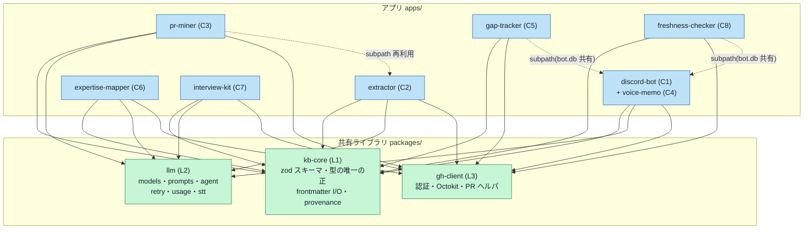

**実行環境で 3 グループに分かれます。**

| グループ | コンポーネント | 環境 | 状態の持ち方 |
|---|---|---|---|
| 常駐 | C1 discord-bot(+C4) | 社内 VM の rootless Docker(ADR-0016) | `bot.db`(SQLite・WAL) |
| VM 定時 | C5 gap-tracker / C8 freshness-checker | 同 VM の systemd user timer(ADR-0014/0019) | **`bot.db` を bot と共有** |
| Actions | C2 extractor / C3 pr-miner / C6 expertise-mapper / C7 interview-kit | GitHub Actions(ephemeral) | ステートレス → カーソルは KB リポに commit |

> C5/C8 が VM 側なのは **bot ローカルの `bot.db`(`pending_actions`)を触る必要がある** から。
> Actions 勢がステートレスなのは ephemeral runner だから — カーソルは `knowledge-base/_meta/` に置きます。

---

## 2. 全アプリ共通の骨格(重要)

**7 アプリすべてが同じ 3 層構造** を持ちます。ここを理解すると個別アプリの読解が一気に速くなります。

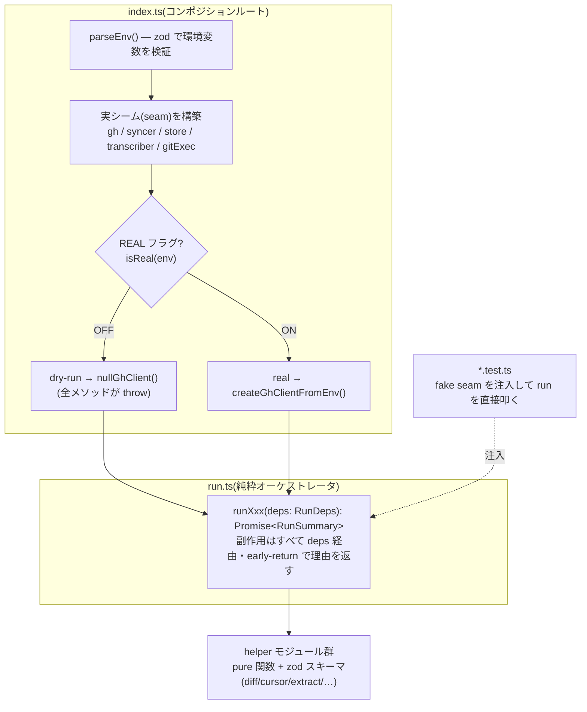

共通のルールは 4 つ:

1. **副作用は必ず注入シーム経由**。`gh`(GitHub)・`syncer`(git)・`store`(SQLite)・`transcriber`(STT)・`gitExec`・`fetchFn` はすべて `index.ts` で構築して `run.ts` に渡す。`run.ts` は `process.env` も `fs` も直接触らない → **fake を刺すだけでユニットテスト可能**。
2. **既定は dry-run**。実副作用(PR 作成・commit)は `isReal(env)` が真のときだけ。dry-run 時は `nullGhClient()`(呼ぶと throw するスタブ)を差し込み、**誤って GitHub を触ったら即クラッシュ** させる(サイレント書き込み防止)。
3. **early-return で「なぜ止まったか」を構造化**。`RunSummary.reason` に `no-changes` / `already-exists` / `dry-run` / `validation-failed` などを返す(冪等性チェックの結果が観測可能)。
4. **`run.ts` は「理由」を返すだけで例外を投げない**。ファイル単位の失敗は try/catch で `skip` に落とし、1 件の失敗が全体を止めない。

> スキーマ(zod)は `kb-core` が唯一の正。各アプリの `config.ts`/`env.ts` も zod で `.strict()` 検証し、
> 未知キーを弾きます(§12.2 の「利用側で型を再定義しない」の実体)。

---

## 3. 共有ライブラリ L1〜L3

### 3.1 L1 `kb-core` — 型とデータの唯一の正

すべての KB 読み書きはここを通します(アプリからの `gray-matter`/`fs` 直叩きは禁止)。

**スキーマ体系**(`src/schemas/`)。Markdown 3 種 + YAML 2 種、そして全体を貫く `sources` 判別共用体:

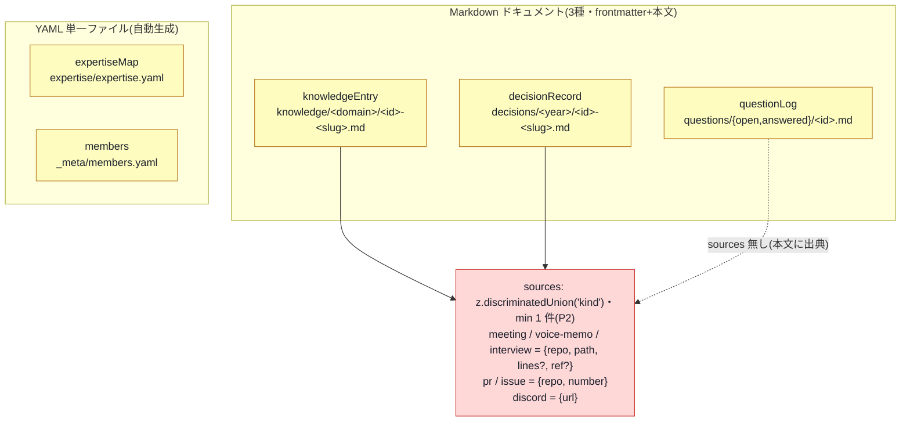

コードで強制している主な不変条件(参照: [validate-repo.ts](../packages/kb-core/src/validate-repo.ts) / [schemas/](../packages/kb-core/src/schemas/)):

- **`type:decision` は `decisions/` にしか置けない**。`knowledge/**` に `type:decision` があれば `validateRepo` が `decision_in_knowledge` を出す。
- **`review_interval_days` の null = 鮮度確認免除(∞)**。`decision` のみ既定 null。`knowledgeEntrySchema` の `.transform` が省略値を `DEFAULT_REVIEW_INTERVAL_DAYS`(procedure=90/fact=180/learning=180/failure=365)で埋め、`serializeEntry` は null のときキーを省いて **round-trip 保存** する。
- **人物識別子は GitHub ユーザ名に統一**。Discord ID は `members.yaml` の申告マッピング([members-io.ts](../packages/kb-core/src/members-io.ts))。未マップは `"unassigned"` にフォールバック。
- **provenance は github.com / discord.com の permalink のみ**許可([provenance.ts](../packages/kb-core/src/provenance.ts) `sourceToUrl`/`urlToSource`)。file 系 3 種は逆変換で `meeting` に正規化される(非対称・要注意)。
- **決定的シリアライズ(P5)**: 固定キー順・`forceQuotes`・`lineWidth:-1`、YAML は `JSON_SCHEMA` ロードで日付を文字列のまま保持 → diff 安定。

**ID 採番は楽観ロック(CAS)**([id-allocator.ts](../packages/kb-core/src/id-allocator.ts))。`kind-YYYY-NNNN`(年は JST、seq 上限 9999):

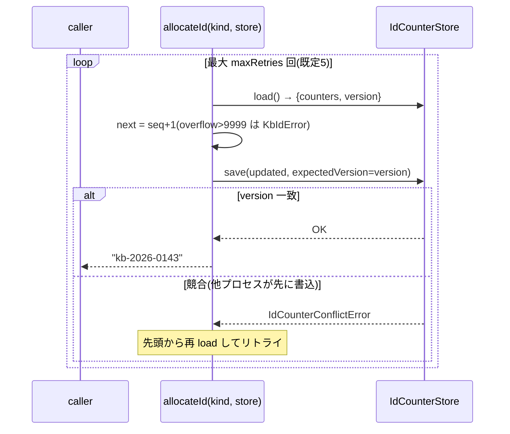

`version` トークンは、ローカルでは `_meta/id-counter.json` のファイル内容そのもの、
本番設計では GitHub Contents API の blob SHA を想定(compare-and-swap)。**conflict のみリトライ**、実 I/O エラーは即伝播。

`validateRepo`(CI と pre-merge で実行)は **fail-closed**: リポ不在や KB らしくないディレクトリは「問題あり」を返す。
レイアウト深さ・`domain` = 親ディレクトリ名・`questions/` の status↔フォルダ一致・ファイル名 = frontmatter `id`・**リポ横断の id 重複** を全件収集(最初のエラーで止めない)。

### 3.2 L2 `llm` — モデル・プロンプト・エージェント封じ込め

| モジュール | 役割 | 要点 |
|---|---|---|
| [models.ts](../packages/llm/src/models.ts) | ロール→ID レジストリ | `fast=claude-haiku-4-5-20251001` / `standard=claude-sonnet-4-6` / `deep=claude-opus-4-8`。呼び出し側は `modelIdFor(role)` のみ、**ID 直書き禁止**。`STT_MODEL=gpt-4o-transcribe` は別軸 |
| [prompts.ts](../packages/llm/src/prompts.ts) | `prompts/<app>/<name>.md` ローダ | frontmatter を gray-matter で解析、`role` を検証。**プロンプトのコード直書き禁止**の実体 |
| [agent.ts](../packages/llm/src/agent.ts) | agentic search ラッパ | `@anthropic-ai/claude-agent-sdk` を **唯一 import** する場所。封じ込めの本体(下図) |
| [retry.ts](../packages/llm/src/retry.ts) | 指数バックオフ | 既定 maxRetries=3。`RATE_LIMITED(429)/OVERLOADED(529)/TIMEOUT` のみリトライ |
| [usage.ts](../packages/llm/src/usage.ts) | トークン記録 | app×role で input/output を記録(sink は注入。bot=SQLite、バッチ=ログ) |
| [stt.ts](../packages/llm/src/stt.ts) | OpenAI 文字起こし | raw `fetch` で `/audio/transcriptions`(SDK 非使用)。`openai` 送信はここに限定(ADR-0015) |

**`runAgentSearch` の封じ込め**(セキュリティ上の心臓部・ADR-0006/§9.5)。議事録や Discord 本文は「信頼できない入力」として扱い、実行能力を構造的に奪います:

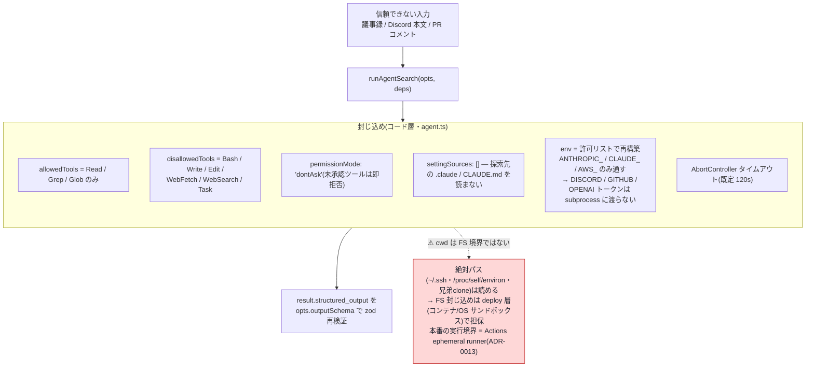

ポイントは **`env` の再構築**: Agent SDK の `Options.env` は `process.env` を **置換** するので、
許可リスト(`AGENT_ENV_ALLOWLIST` + `ANTHROPIC_`/`CLAUDE_`/`AWS_` 接頭辞)以外は subprocess に渡らず、
`/proc/self/environ` 経由のトークン漏洩を塞ぐ。構造化出力は `zodToJsonSchema` を `outputFormat` に渡し、戻りを必ず `safeParse` で再検証。

### 3.3 L3 `gh-client` — 認証非依存の GitHub ラッパ

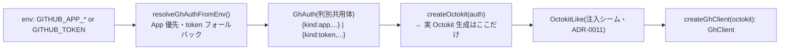

`GhClient`([client.ts](../packages/gh-client/src/client.ts))の主なメソッド:

| メソッド | 用途 | 備考 |
|---|---|---|
| `createPullRequest` | 複数ファイル 1 commit の PR(blob→tree→commit→ref→pulls) | 409/422 → `CONFLICT` |
| `commitFiles` | 既存ブランチに複数ファイルを 1 commit(非 force) | `deletions` でファイル移動対応 |
| `mergePullRequest` / `getPullRequest` | 代理マージ / pre-merge の clean 判定 | 既定 squash |
| `getFileContents` | ファイル本文 + blob SHA(CAS 用) | 無ければ null |
| `listMergedPullRequests` | カーソル以降のマージ済 PR(新しい順) | pr-miner |
| `listPullRequestComments` / `listPullRequestFiles` | 会話+レビューコメント / 変更ファイル要約 | **patch 本体は取らない** |
| `listCommits` | 既定ブランチの commit(author=login のみ) | expertise-mapper(ADR-0017 D2) |

認証は **auth-agnostic**(ADR-0011): `client.ts` は実 Octokit を知らず `OctokitLike` にのみ依存。
read=PAT / write=App のハイブリッド(ADR-0013 D4)は **アプリ側**(pr-miner/expertise-mapper が `ghRead` を別途組む)で実現し、
`gh-client` 自体は 1 つの `GhAuth` を返す薄い層に保つ。

---

## 4. C1 discord-bot

唯一の常駐プロセス。Gateway イベントを各ハンドラへ振り分けるハブで、**C4 voice-memo もここに同居** します。

### 4.1 起動とイベント配線

`index.ts::main` が env/config をロードし、実シーム(`gh`/`store=sqlite`/`syncer`/`promptStore`/`transcriber`)を組み立てて `createBot(deps)`([discord.ts](../apps/discord-bot/src/discord.ts))に注入。
`gh` や `transcriber` は資格情報が無ければ **warn して該当機能だけ OFF**、bot 自体は起動継続。

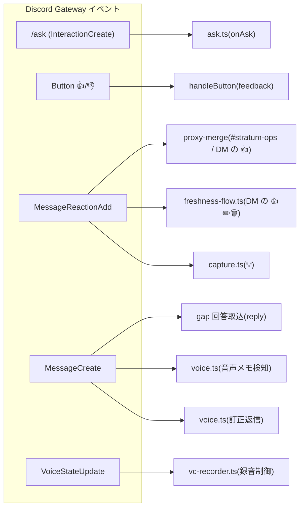

intents は `Guilds / GuildMessages / GuildMessageReactions / DirectMessageReactions / MessageContent(特権) / GuildVoiceStates(ADR-0020)`、
partials は `Message/Reaction/User/Channel`。

> **`warmDmChannels`(PR #68)**: discord.js 14.26 の既知バグで、**未キャッシュの DM への `MessageReactionAdd` が発火しない**
> (`Partials.Channel` でも不発)。再起動後に鮮度確認/キャプチャの DM 👍 が死ぬため、起動時に `members.yaml` 全員へ
> `users.createDM()` してキャッシュを温める(メッセージは送らない)。

### 4.2 `/ask` パイプライン

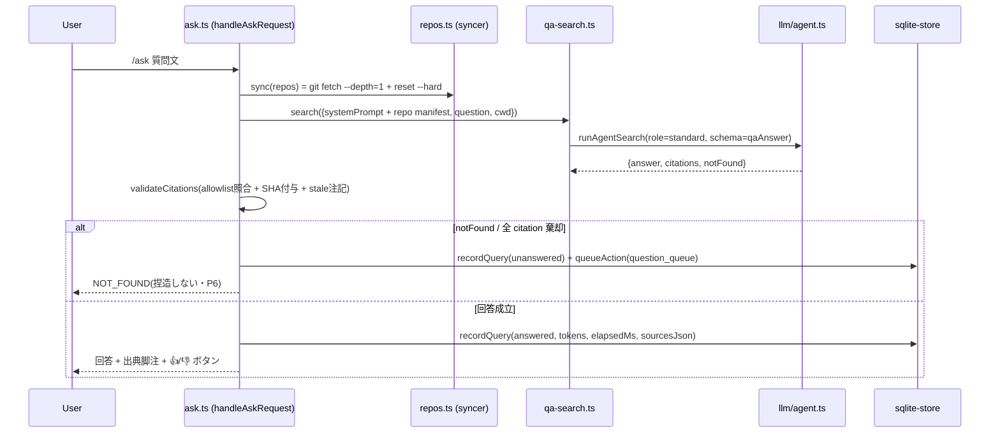

`validateCitations`([ask.ts](../apps/discord-bot/src/ask.ts))が守るもの:
- Discord permalink は正規表現、GitHub repo は **同期済み allowlist に含まれること**、file は path-traversal ガード + 実在チェック。
- **`ref`(commit SHA)は bot が `syncedRepo.resolvedCommit` から付与**(LLM に SHA を作らせない)。
- `.md` 出典は `safeParseEntry` で読み、`status:"stale"` なら破棄せず `stale:true` を立てて `STALE_NOTE` 付き引用(§6.7/C8 連携)。

**Git への書き込み経路は最小化**: NOT_FOUND / 👎 は即 commit せず `pending_actions(question_queue)` に積み、gap-tracker が日次でまとめて commit。

### 4.3 capture(💡)

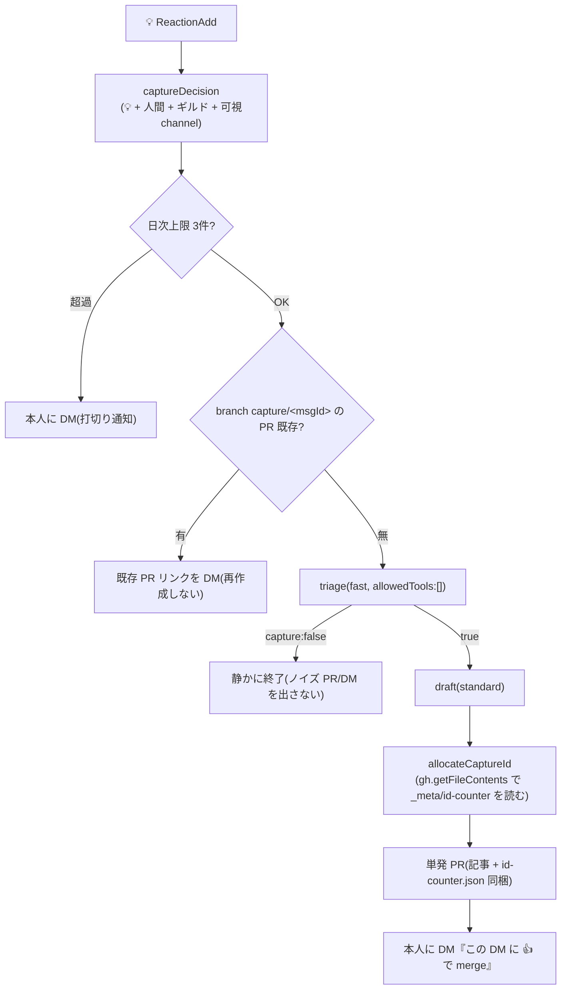

冪等キーはブランチ名 `capture/<messageId>`。ローカル clone を持たず、id 採番は `gh.getFileContents` + メモリ内 `allocateId` で PR に counter を同梱。

### 4.4 voice-memo(C4)+ VC 録音

2 入口 → 共通 worker(`SerialQueue`)→ STT → 原本 + capture 流 PR → 通知/訂正。

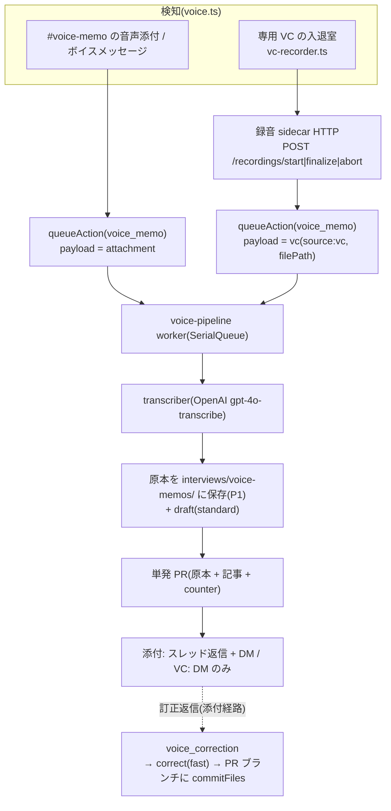

**VC 録音の状態機械**([vc-recorder.ts](../apps/discord-bot/src/vc-recorder.ts)・ADR-0020):
`VoiceStateUpdate` から bot を除いた人数で判定 — **セッション無し+1人以上 → start / セッション有り+0人 → finalize / それ以外 → noop**(1 人語り限定で owner を一意化)。
`max_recording_minutes`(既定 15)で自動 finalize。成果 m4a は共有マウント(`/recordings`)経由で受け渡し、`source:"vc"` payload で既存パイプラインに合流。
STT の transient エラー(RETRYABLE)は pending 据え置きで再試行、permanent は通知して done。

### 4.5 鮮度確認 UI とチャンネルゲート

- **鮮度 UI**([freshness-flow.ts](../apps/discord-bot/src/freshness-flow.ts)): freshness-checker が `bot.db` に書いた `pending_actions(freshness)` を 10 分毎に読み、DM 送信後 `setActionState(sent)`(再起動での二重送信防止)。DM の 👍✏️🗑 は `applyFreshnessReaction` が処理し、`validateRepo` を通してから main に直 commit(✏️ は編集用 PR)。cross-process 契約(payload schema)は **discord-bot が所有**し checker が import(§4.8)。
- **チャンネルゲート**([visibility.ts](../apps/discord-bot/src/visibility.ts)・ADR-0018): 「**bot が ViewChannel を持つチャンネル = 読む**」方式。`/ask` は `interaction.appPermissions`(payload 由来・キャッシュ非依存)、MessageCreate/ReactionAdd は `channel.permissionsFor(members.me, {checkAdmin:false})`。`permanent_exclude`(§9.3 denylist)は親チャンネル ID でも照合。
- **members**: `members.yaml` は **KB clone から都度読む**([members.ts](../apps/discord-bot/src/members.ts)・ADR-0017 D3)ので、再起動なしで反映。

### 4.6 状態レイヤ(bot.db)

`BotStore` インタフェース([db.ts](../apps/discord-bot/src/db.ts))に memory / sqlite の 2 実装。テーブルは `queries` / `pending_actions` / `rate_limits`。
`journal_mode=WAL` + `busy_timeout=5000` が、**別プロセスの gap-tracker / freshness-checker が同じ `bot.db` を開く** ことを可能にしている(VM 共有)。
`pending_actions` が **プロセス間キュー**の実体(bot が書き、バッチが読む/その逆)。この app-as-library 面([subpath exports](../apps/discord-bot/package.json))を C5/C8 が import し、DB スキーマを再定義しない。

---

## 5. C2 extractor / C3 pr-miner

抽出の中核。pr-miner は extractor の `reconcile`/`materialize`/`domains`/`candidate` を **subpath で再利用** し、入力ソースだけ差し替える。

### 5.1 extractor 夜間パイプラインと 3 つのゲート

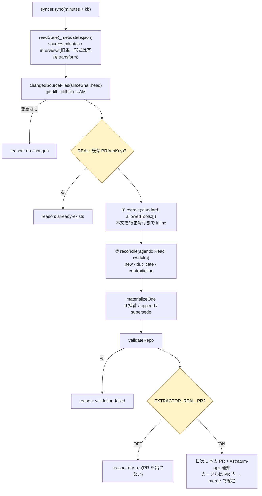

**REAL-PR ゲートは 3 段**: ①`index.ts` で `nullGhClient` を差す ②実行前に既存 PR を検出して skip ③`run.ts` 末尾で `!realPr` なら PR を作らず `dry-run` を返す。
**二相の実行境界**(ADR-0012/0013)が要点:
- **extract は `allowedTools:[]`**。議事録本文をプロンプトに inline(`L{n}:` 行番号付き)して構造化抽出のみ。他リポの読み書きは構造的に不可能。
- **reconcile は agentic Read**(Read/Grep/Glob・`cwd=kb clone`)。候補 1 件 = 1 コンテキスト(blast-radius 1)で既存 KB を実検索し `new/duplicate/contradiction` を判定。

**冪等性**: PR タイトルに **SHA レンジ**(`<minutes7>+<kb7>`)を埋め、カーソルは merge 時にしか進まないので、create↔merge の隙間で再実行しても同じ runKey で既存 PR を検出。

`materializeOne`([materialize.ts](../apps/extractor/src/materialize.ts))は分類で分岐: `new`=採番して新規、`duplicate`=`sources` に追記のみ、`contradiction`=旧 `superseded`+新規。
**per-kind の `sourceKey`**(meeting系=`kind+repo+path` / pr・issue=`kind+repo+#number` / discord=`url`)が重複判定の鍵。

### 5.2 pr-miner と共有再利用

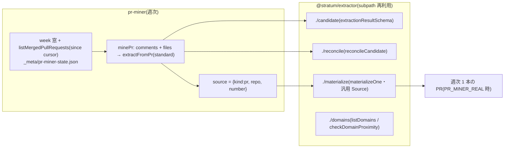

統一点は `MaterializeInput.source` の **汎用 `Source`**。extractor は `{kind:meeting|interview,...}`、pr-miner は `{kind:pr,...}` を組み立て、
`materializeOne`/`sourceKey` が `kind` で分岐するので **同一の materialize + dedup 経路** に載る。
pr-miner は `targets: []` で **機能 OFF**、read は `GITHUB_READ_TOKEN`(PAT)/ write は App(ADR-0013 D4)、diff 本体は知識化しない(**判断と理由のみ**)。

---

## 6. C5 gap-tracker

**フライホイール(需要駆動の穴埋め循環)の実体。** `index.ts::main` が **3 つのオーケストレータを順に**実行(いずれも `bot.db` 共有・`isReal` ゲート・独立冪等)。

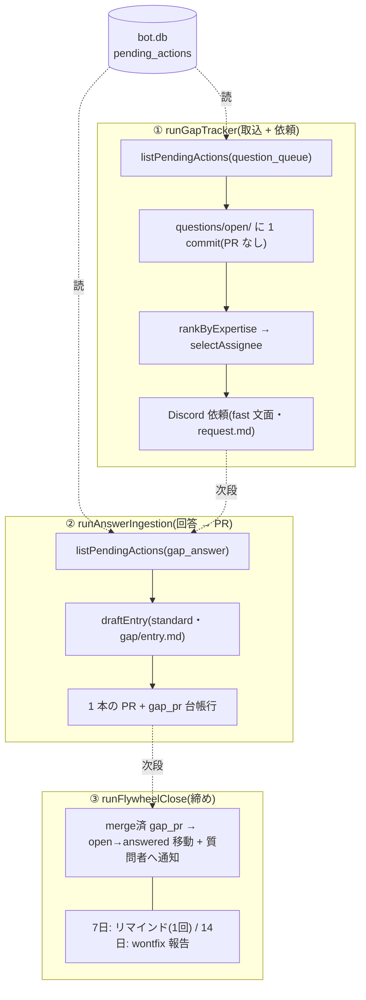

**担当者への依頼上限は「週 3 件/人」**。ただしこれは **`index.ts` のハードコード定数**で、`store.hitRateLimit("assignee:<github>", "gap_request", isoWeekKey(now), 3)` で強制(`gap.yaml` にフィールドは無い)。
専門家への負荷集中はフライホイール最大の失敗要因なのでコードで固定。
`bot.db` は `@stratum/discord-bot/sqlite-store` を import して開く(C5 は queue の consumer)。冪等は `markActionDone` + 本文の queryId スキャンの二層。

> LLM を使うのは `draftEntry` の 1 箇所のみ。プロンプト frontmatter は `role: standard`(design 表記の "fast" とは差異あり — 実装が正)。

---

## 7. C6 expertise-mapper

**唯一すでに本番稼働中**(毎週月曜 02:00 JST)。プライバシー設計(LLM に人名・数値を渡さない)と決定的指標が肝。

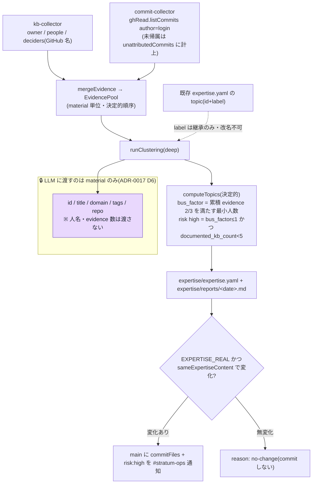

- **クラスタリング単位は material(人ではない)**。人名・数値を LLM に見せないので、出力から個人を復元できない。
- **topic 名は「継承のみ・改名不可」** を出力形式で構造的に保証(週跨ぎの安定性 = 受け入れ条件)。1 回だけ矯正リトライ、それでも不正なら fail-loud。
- **指標は決定的**(整数演算): `bus_factor` は累積 evidence が全体の 2/3 に達する最小人数。`documented_kb_count` は kb-entry material のみ(repo は除外)。
- **無変化週は commit しない**(`sameExpertiseContent` は `generated_at` を無視)。read=PAT / write=App のハイブリッド。

---

## 8. C7 interview-kit / C8 freshness-checker

### 8.1 C7 interview-kit(手動 workflow_dispatch)

最小アプリ(config 無し・env のみ)。`person`/`topic`/`INTERVIEW_REAL` を入力に、`deep` が **agentic search** で KB を読み、未文書化の穴を突く質問 10〜15 問(schema は 5〜20 許容で境界ドリフトを吸収)を生成 → `interviews/kits/<person>-<topic>.md` に PR。冪等は既存 open PR 検出。KB エントリではないので `validateRepo`/staging は無し。

### 8.2 C8 freshness-checker(VM 定時・LLM 不使用)

**決定的な日付演算のみ**(AWS/Claude env 無し)。bot との cross-process 契約が要点。

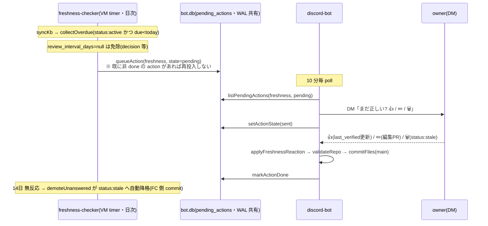

**contract の所有者は discord-bot**: `FRESHNESS_ACTION_TYPE`/`freshnessPayloadSchema`/`parseFreshnessPayload` を [discord-bot/src/freshness.ts](../apps/discord-bot/src/freshness.ts) が定義し、
freshness-checker は `@stratum/discord-bot/freshness` から **import**(型を再定義しない・§12.2)。checker が writer、bot が reader。
`daily_limit_per_owner`(既定 2)は config 駆動(gap-tracker の週3件がコード定数なのと対照的)。

---

## 9. 横断的な設計パターン

### 9.1 dry-run ゲート一覧

| アプリ | フラグ(env) | 強制箇所 | OFF 時の副作用 |
|---|---|---|---|
| extractor | `EXTRACTOR_REAL_PR` | `nullGhClient` + 既存PR検出 + run 末尾 | 無し(dry-run) |
| pr-miner | `PR_MINER_REAL`(+ `targets` 空で OFF) | 同上 | 無し |
| expertise-mapper | `EXPERTISE_REAL` | `failLoudGhClient` + run.ts commit 前 | 無し |
| interview-kit | `INTERVIEW_REAL` | run.ts createPR 前 | 無し |
| gap-tracker | `GAP_TRACKER_REAL` | 3 オーケストレータ各々 | 無し(rate-limit はローカル模倣) |
| freshness-checker | `FRESHNESS_REAL` | enqueue と demote commit の 2 箇所 | 無し(「投入予定」ログのみ) |
| discord-bot | (常時 real) | — | `gh` 未設定なら該当機能 OFF で継続 |

### 9.2 冪等性の作り方

- **PR タイトル/ブランチ名にキーを埋める**: extractor=SHA レンジ、pr-miner=`pr-miner/<isoWeek>`、capture=`capture/<msgId>`、gap=回答ハッシュ、freshness 編集=`freshness/<entryId>-<actionId8>`。実行前に **既存 open PR を検出して skip**。
- **カーソルは成功後・merge 後にしか進めない**(§7.1)。extractor/pr-miner はカーソルを PR 内で更新するので merge で確定。
- **`pending_actions` は `markActionDone`/`setActionState`** で状態遷移(pending→sent→done)。再起動で二重送信しない。

### 9.3 状態とカーソルの置き場

| 種別 | 置き場 | 使う人 | 理由 |
|---|---|---|---|
| 運用状態(query/queue/rate) | `bot.db`(SQLite・WAL) | C1 / C5 / C8(VM 共有) | Gateway・ボタンの即応、プロセス間キュー |
| 抽出カーソル | `knowledge-base/_meta/state.json` / `pr-miner-state.json` | C2 / C3 | Actions は ephemeral → KB に commit |
| 専門性の前回状態 | 成果物 `expertise/expertise.yaml` 自体 | C6 | 別カーソル不要(増分の入力 = 前回出力) |
| KB 本体 | Git 履歴 | 全員 | P5: Git がデータベース |

### 9.4 セキュリティの多層

エージェント封じ込め(§3.2)/ 構造化出力のみ受領 / env 許可リスト / ログの秘密値二層スクラブ([logger.ts](../apps/discord-bot/src/logger.ts))/ clone 後の `remote set-url` でトークンを `.git/config` に残さない / `git rev-parse --git-dir` プローブで**親リポの `reset --hard` 破壊を fail-loud で防止**(2026-07-17 の実インシデント対策)。

---

## 10. 状態とデータフローの全体像

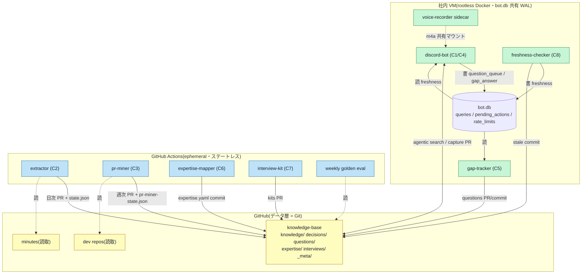

---

## 11. テスト戦略と技術的負債

**テスト**(§10):
- `kb-core`/`llm`/`gh-client` はユニット必須、LLM/GitHub はモック。各アプリの `run.ts` は fake seam を注入して純粋に叩く(`*.test.ts` が各モジュールに同居)。
- CI(`.github/workflows/ci.yml`): biome lint → typecheck → vitest → **knowledge-base スキーマ検証**(`validateRepo`)。赤い validate の PR はマージ不可(ADR-0004 D2)。
- 週次ゴールデン評価(`weekly-eval.yml`): 出典一致率 + `deep` の LLM-as-judge。ベースライン −10pt で #stratum-ops 警告。

**将来の整理対象(記録済み・実害は小)** — 各所に「3 番目の利用者が出たら共有パッケージへ」の TODO コメントあり:

| 重複 | 箇所 | メモ |
|---|---|---|
| `createLogger` | 全バッチアプリでほぼ byte-identical | 共有 `@stratum/logging` 化候補 |
| `syncKb` / `stripCredentials` / git プローブ | gap-tracker と freshness-checker で同一、extractor `repos.ts` が原型 | 親リポ破壊ガードを含むので慎重に共通化 |
| `slugify` | extractor `slug.ts` / interview-kit / gap `answer.ts` の変種 | |
| `notify`(webhook poster) | 各アプリにコピー(文面差でメッセージだけ違う) | |
| `isoJst` 等 JST ヘルパ | 複数アプリ(意図する原点は discord-bot `time.ts`) | |
| `nullGhClient` / `failLoudGhClient` | 各 `index.ts` に逐語コピー | |

そのほかの将来 PR(§メモ由来): Discord 発言コレクタ / 議事録の speaker_labels コレクタ(C6 の evidence 拡張)/ **矛盾検出バッチ**(freshness 🗑 が積む `contradiction_check` の消費者)/ gap-tracker の asker 解決を members 参照へ修正。

---

### 参照
- 設計の正: [design.md](./design.md)(§2 原則・§6 各コンポーネント・§7 横断方針・§9 セキュリティ)
- 判断の経緯: [adr/](./adr/)(特に 0003 スキーマ / 0006 封じ込め / 0009 Claude on AWS / 0011 auth-agnostic / 0013 実行境界 / 0014・0019 VM timer / 0016 Docker / 0017 expertise / 0018 可視性ゲート / 0020 VC 録音)
- 有効化手順: [runbooks/](./runbooks/)、配置: [deploy/README.md](./deploy/README.md)
- 非エンジニア向け概要: [system-overview.md](./system-overview.md)
