# stratum ナレッジ基盤 — 図で見る「今どこまで出来ているか」

> **このドキュメントは誰向け?**
> エンジニアでなくても、このシステムが「何をするものか」「今どこまで出来ていて、あと何が残っているか」を
> 図でざっと把握できるようにまとめたものです。専門用語には最初に説明を付けています。
>
> - **最終更新**: 2026-07-21(スナップショット。実装は日々進むので、正確な最新は Git 履歴を参照)
> - **正式な設計書**: [docs/design.md](./design.md)(唯一の設計の正。細部はこちら)
> - **一言でいうと**: 🟩 **コードはほぼ全部完成。残りは主に「鍵や設定を入れてスイッチを入れる」人間作業と、いくつかの経営判断です。**

---

## 1. このシステムは何をするのか

会社には、会議・チャット・PR(開発の記録)などに **「その人しか知らない知識(暗黙知)」** が大量に眠っています。
人が辞めると、その知識ごと消えてしまう——これが解決したい問題です。

このシステム(コード名 **`stratum`** = 地層)は、次の状態を **メンバーの手間ほぼゼロ** で実現・維持します。

> **「誰かが質問したら、過去の全記録から “根拠つき” で答えが返ってくる」**

大事な考え方は 3 つだけです。

| 考え方 | 意味(かみ砕くと) |
|---|---|
| 🔗 **出典が必ず付く** | Bot の答えもナレッジ記事も、必ず「どの会議のどの発言が根拠か」のリンクを持つ。根拠のない知識は「無い」扱い |
| 👆 **人間の操作はワンタップまで** | 人に求めるのは「絵文字を押す」「ボタンを押す」「PR を承認する」「1〜2 文で返信する」「喋る」だけ。フォーム記入は求めない |
| ♻️ **答えられない質問が燃料になる** | Bot が答えられなかった質問を記録し、専門家に「1 問だけ」聞いてナレッジ化する。これを繰り返して賢くなる(フライホイール) |

---

## 2. 全体の流れ(いちばん大事な 1 枚)

知識が「生まれて → 整理されて → 使われて → 足りない所が埋まる」という循環で回ります。

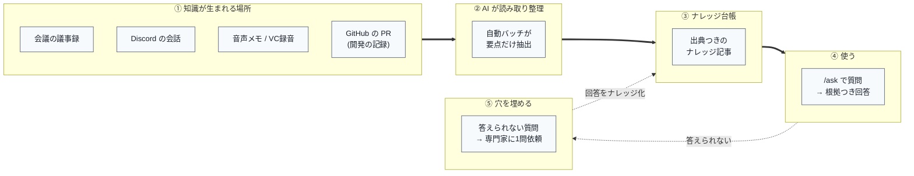

**読み方**: 左から右へ知識が流れます。右下の「答えられない質問」が左の台帳に戻ってくる **点線のループ** が、
このシステムの心臓部です。使えば使うほど台帳が育ちます。

---

## 3. システムの構成(誰が誰と話すか)

登場するのは大きく **4 つの場所** です。

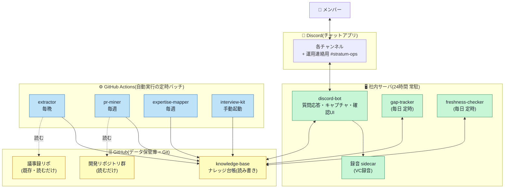

- 🟩 **社内サーバ(常駐)**: 常に起動していないと動けないもの(チャットの受信・ボタン操作)だけを置く最小構成。
- 🟦 **GitHub Actions(定時バッチ)**: 「毎晩」「毎週」自動で走る重い処理。普段は動いていないので低コスト。
- 🟨 **GitHub(データ保管庫)**: 知識の本体は **すべてテキストファイルとして Git で保管**。Word や DB ではなく、
  「バージョン管理された文書フォルダ」だと思ってください。誰が・いつ・何を変えたかが全部残り、承認は PR(変更提案)で行います。

---

## 4. データはどこにある?(Git = データベース)

知識は 2 つのリポジトリ(=フォルダ)に分けて保管します。**コード(部品)とデータ(知識)を混ぜない** ためです。

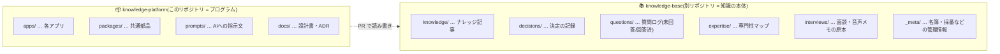

ナレッジ記事は 1 件が 1 つのテキストファイルで、先頭に「見出し情報」が付きます(下は例)。
この見出しの形式は厳密にチェックされ、**形式が壊れた記事は台帳に入れられない** 仕組みです(自動検査 = CI)。

```markdown
---
id: kb-2026-0142                      # 記事の背番号(不変)
title: 分注ロボット X は高湿度で Y 軸が脱調する
type: failure                          # 決定 / 学び / 手順 / 事実 / 失敗知
domain: hardware                       # 分野
sources:                               # ← 必ず「出典」が付く(根拠のない知識は無し)
  - kind: meeting
    repo: org/minutes
    path: 2026/06/2026-06-03-hw-weekly.md
people: [yamada, suzuki]               # 関係者
confidence: high                       # AI の自己申告する確からしさ
status: active                         # active(有効) / stale(要確認) / superseded(世代交代)
last_verified: "2026-06-10"            # 最後に「まだ正しい」と確認した日
owner: yamada                          # 鮮度確認の宛先
---
## 事象
（本文。AI が下書きし、人間が PR で直せる）
```

---

## 5. 部品(コンポーネント)一覧

システムは 8 つのアプリ(C1〜C8)と 3 つの共通部品(L1〜L3)でできています。

| ID | 名前 | ひとことで言うと | 実行場所 |
|---|---|---|---|
| **C1** | discord-bot | 質問に答える・💡で拾う・確認ボタンを出す **窓口** | 社内サーバ(常駐) |
| **C2** | extractor | 毎晩、議事録から要点を **自動で記事化** | GitHub Actions(毎晩) |
| **C3** | pr-miner | 毎週、PR から **設計判断・ハマりどころ** を抽出 | GitHub Actions(毎週) |
| **C4** | voice-memo | 音声メモ・VC録音を文字起こしして記事化 | 社内サーバ(bot 内)+ 録音sidecar |
| **C5** | gap-tracker | 答えられなかった質問を **専門家に1問依頼** して埋める | 社内サーバ(毎日 定時) |
| **C6** | expertise-mapper | 「誰が何に詳しいか」を可視化・**バス係数**を検出 | GitHub Actions(毎週) |
| **C7** | interview-kit | 未文書化の穴を突く **面談質問リスト** を生成 | GitHub Actions(手動起動) |
| **C8** | freshness-checker | 古くなった記事を **owner に確認** して鮮度を保つ | 社内サーバ(毎日 定時) |
| L1 | kb-core | 台帳の読み書き・形式チェックの **共通ルール** | 共通ライブラリ |
| L2 | llm | AI 呼び出し・指示文の管理・コスト記録 | 共通ライブラリ |
| L3 | gh-client | GitHub とのやりとり(認証・PR作成) | 共通ライブラリ |

> 📌 **バス係数**とは「その人が突然いなくなると立ち行かなくなる人数」。**1 が最も危険**(一人しか知らない)。
> C6 はこの「バス係数 1 の領域」を見つけて警告するのが仕事です。

---

## 6. 各部品を図解

### C1 discord-bot — 質問応答の窓口(`/ask`)

`/ask 質問文` と打つと、AI が議事録とナレッジ台帳を検索し、**根拠リンク付き** で答えます。
根拠が無ければ **推測せず「未回答」** として記録します(これが後で穴埋めの燃料になる)。

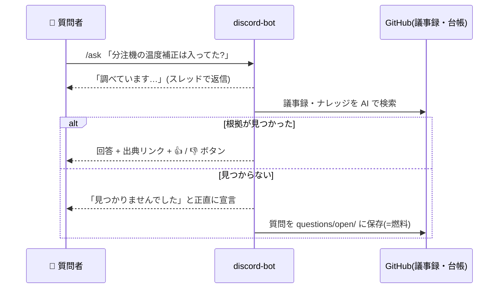

**ポイント**: AI に許すのは「読む・探す」だけで、「書き込む・コマンド実行・ネット接続」は禁止。
悪意ある文章を読んでも実害が出ない設計です(プロンプトインジェクション対策)。

### C2 extractor — 毎晩の自動記事化

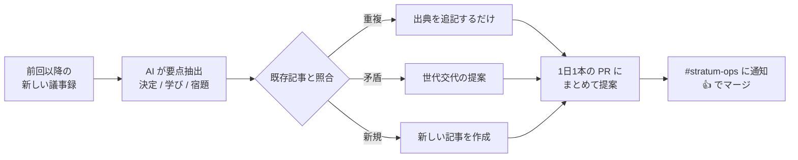

人間は「PR を見て 👍」だけ。無理な水増しはせず、雑談だけの議事録は「抽出なし」を正解とします。

### C3 pr-miner — PR から設計判断を発掘(毎週)

開発の PR には「なぜこう決めたか」「何にハマったか」が埋もれています。
diff(コードの差分)そのものは知識化せず、**判断と理由だけ** を抜き出して台帳に提案します。

### C4 voice-memo — 喋るだけでナレッジ化

2 つの入口があります。どちらも「喋る」以外の手間はほぼゼロです。

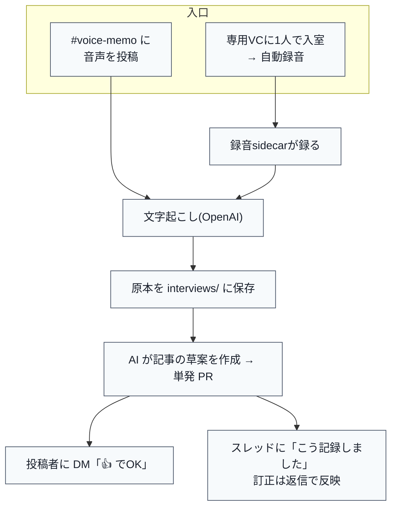

> 🎙️ **VC録音**(ADR-0020)は最近追加された第 2 の入口。専用ボイスチャンネルに **1 人で入ると録音開始、
> 出ると終了**。録音は専用の録音 Bot と sidecar(補助コンテナ)が担当します。

### C5 gap-tracker — フライホイール(穴埋めの循環)

このシステムを賢く育てる中核です。

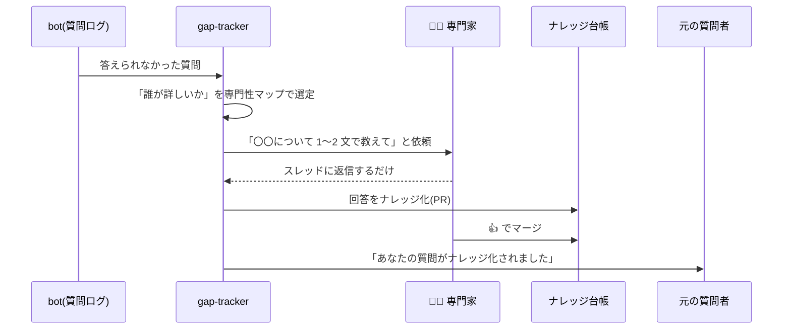

> 専門家 1 人への依頼は **週 3 件まで**。特定の人に負担が集中するのを防ぎます(依頼疲れ対策)。

### C6 expertise-mapper — 「誰が何に詳しいか」の地図(稼働中)

議事録・commit・ナレッジから、トピックごとの詳しい人を集計し、**バス係数 1(=一人しか知らない)** の
危険領域を検出して警告します。この部品は **すでに本番稼働中**(毎週月曜 02:00 に自動実行)。

### C7 interview-kit — 穴を突く面談質問リスト

「まだ文書化されていない所」を狙って、AI が面談用の質問 10〜15 問を生成します。
それを使って 30〜60 分ヒアリング → 録音 → 自動で複数記事化、という流れです(手動で起動)。

### C8 freshness-checker — 鮮度を保つ

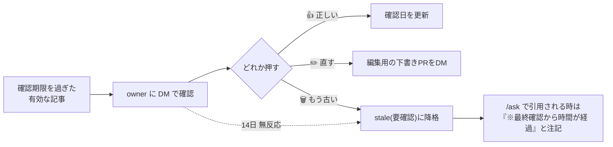

> 古い記事も **回答から消しはしません**。「時間が経っています」と注記を付けて引用するだけ。
> 1 人あたり 1 日 2 件までしか確認を求めません(確認疲れ対策)。

---

## 7. 現在の実装状況(ダッシュボード)

**結論から言うと、設計ロードマップ(Phase 0〜4)のコードはすべて実装・マージ済みです。**

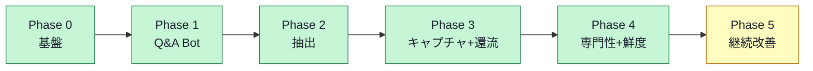

各部品の状態を「コード」と「本番で動いているか」に分けて見ると、こうなります。

### ステータスの見方
- ✅ **稼働中** — コード完成 & 実際に動いている
- 🟦 **有効化待ち** — コード完成。あとは人間が鍵・設定を入れてスイッチを入れるだけ
- ⚙️ **将来対応** — 記録済みの追加開発予定(今は未着手でも困らない)

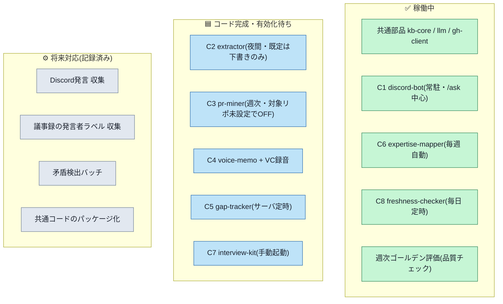

### 詳細ステータス表

| 部品 | コード | 本番稼働 | 補足 |
|---|:---:|:---:|---|
| L1 kb-core / L2 llm / L3 gh-client | ✅ | ✅ | 全アプリが利用。形式チェック CI 稼働 |
| **C1 discord-bot** | ✅ | ✅ | 社内 VM の Docker で常駐。`/ask` 稼働。💡/音声/鮮度の各 UI は設定投入で順次有効化 |
| **C2 extractor** | ✅ | 🟦 | 夜間バッチは組込み済み。**実 PR 提案は既定 OFF(下書きのみ)**。対象リポ変数 +`REAL` フラグで有効化 |
| **C3 pr-miner** | ✅ | 🟦 | 週次バッチ組込み済み。**対象リポ未設定=OFF**。§14#5(対象リポ決定)+`REAL` フラグ待ち |
| **C4 voice-memo(+VC録音)** | ✅ | 🟦 | 音声メモ・VC録音とも全マージ済み。OpenAI 鍵・専用チャンネル・録音Bot の投入待ち |
| **C5 gap-tracker** | ✅ | 🟦 | サーバ定時タイマーの配置・有効化待ち |
| **C6 expertise-mapper** | ✅ | ✅ | **2026-07-16 本番稼働開始**。毎週月曜 02:00 に自動実行(初回実 commit 済み) |
| **C7 interview-kit** | ✅ | 🟦 | 手動起動(workflow_dispatch)。台帳リポ変数を入れれば即使える |
| **C8 freshness-checker** | ✅ | ✅ | **2026-07-18 稼働確認済み**(期限検知 → DM → 🗑 → stale 降格 commit を実データで一周)。毎平日 11:00 に自動実行 |
| 週次ゴールデン評価 | ✅ | ✅ | Q&A 品質を毎週自動採点し、劣化を #stratum-ops に警告 |

> ⚠️ **C8 の E2E で見つかった不具合(修正済み)**: discord.js(チャットライブラリ)の既知バグで、
> **一度も開いていない DM への絵文字リアクションが検知されない** という問題がありました。
> 対策として「起動時にメンバー全員の DM を温めておく(warmDmChannels)」修正を投入済み(PR #68)。
> 残る片付けは「/ask の注記表示の目視」と「検証用カナリア記事 kb-2026-0004 の削除」の 2 点のみです。

---

## 8. 残タスク

残りは大きく **3 種類** です。難しいコード作業はほぼ残っておらず、中心は「設定を入れる」人間作業です。

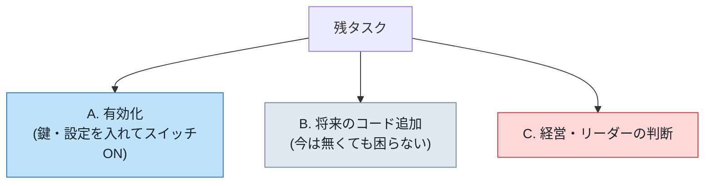

### A. 有効化タスク(人間が設定を入れる)

各部品には「開始手順書(runbook)」が [docs/runbooks/](./runbooks/) に用意されています。

| 対象 | やること(要約) | 手順書 |
|---|---|---|
| C2 extractor | 対象リポ変数を設定 → 下書きを目視 → `EXTRACTOR_REAL_PR` を ON | [extractor-real-run.md](./runbooks/extractor-real-run.md) |
| C3 pr-miner | §14#5 で対象リポを決定 → 変数設定 → `PR_MINER_REAL` を ON | [pr-miner-weekly.md](./runbooks/pr-miner-weekly.md) |
| C4 voice-memo | OpenAI API 鍵を発行しサーバへ → 専用 `#voice-memo` を作成 → 設定 yaml | (音声) |
| C4 VC録音 | 録音専用 Bot を発行 → 専用 VC を作成 → `voice.yaml` に設定 → compose 起動 | [voice-memo-vc.md](./runbooks/voice-memo-vc.md) |
| C5 gap-tracker | サーバの定時タイマー(systemd unit)を配置・有効化 | [deploy/](./deploy/)(`stratum-gap-tracker.timer`) |
| C8 freshness-checker | 設定配置 → 下書き確認 → `FRESHNESS_REAL` を ON → E2E 仕上げ | [freshness.md](./runbooks/freshness.md) |
| C7 interview-kit | 台帳リポ変数を設定(手動起動なので即利用可) | — |

### B. 将来のコード追加(記録済み・急がない)

- 🧩 **Discord 発言の収集** — 専門性マップ(C6)の材料を増やす。名簿が埋まってから
- 🧩 **議事録の発言者ラベル収集** — 「誰が何を言ったか」をより正確に
- 🧩 **矛盾検出バッチ** — 「もう古い🗑」で溜まる矛盾候補を処理する消費者
- 🧩 **共通コードのパッケージ化** — logger / kb-sync / slugify などの重複(3〜4 箇所)を 1 つに整理
- 🧩 **gap-tracker の質問者解決の修正** — 参照先を members 名簿に統一

### C. 経営・リーダーの判断(§14 未決事項)

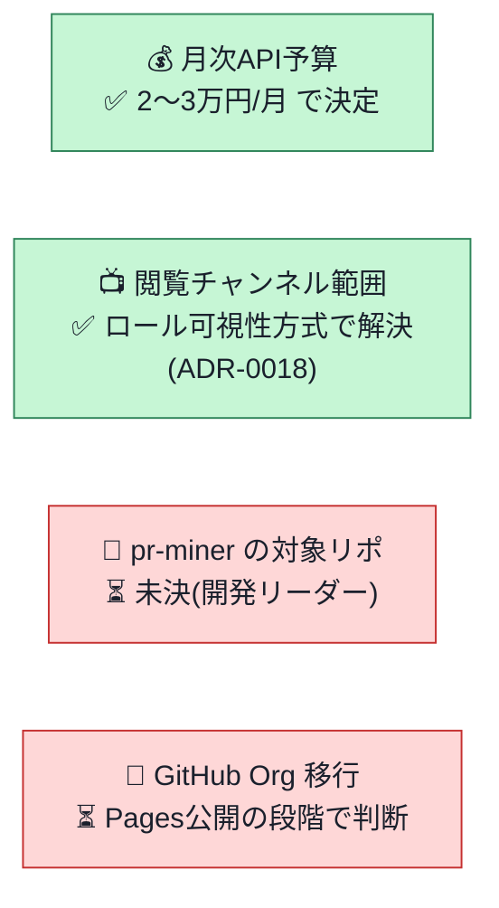

---

## 9. 技術スタック(参考・かみ砕き版)

| 何に | 使っているもの | かみ砕くと |
|---|---|---|
| プログラム言語 | TypeScript / Node.js | Web 系で広く使われる言語 |
| AI モデル | Claude(用途で fast / standard / deep を使い分け)+ OpenAI(音声の文字起こしのみ) | 速さ・賢さ・コストのバランスで 3 段階 |
| チャット | Discord(discord.js) | 社内の会話・操作の窓口 |
| データ保管 | Git / GitHub | 「履歴が全部残る文書フォルダ」。承認は PR |
| 検索方式 | agentic search(AI がファイルを探し読む) | 専用の検索 DB は今は作らない(規模的に不要) |
| 常駐サーバ | 社内 Ubuntu VM の rootless Docker | 24時間動く部分だけをここに |
| 定時バッチ | GitHub Actions(cron) | 毎晩・毎週の自動実行。ほぼ無料 |

> 💡 あえて **やらないこと**(design.md §1.3): ベクトル DB のような専用検索基盤、汎用 Wiki の置き換え、
> 人事・給与など機微情報の取り込み、社外公開機能。**「必要になった証拠が出るまで複雑にしない」** が方針です。

---

## 10. 用語集(非エンジニア向け)

| 用語 | 意味 |
|---|---|
| **リポジトリ / リポ** | ファイルの入れ物。ここでは「プログラム置き場」と「知識置き場」の 2 つ |
| **PR(プルリクエスト)** | 「この変更を入れていい?」という提案。👍 でマージ(反映)する承認フロー |
| **マージ** | PR を承認して本体に取り込むこと |
| **commit(コミット)** | 変更を 1 まとまりとして記録すること |
| **出典 / provenance** | 知識の根拠(どの記録の何行目か)。このシステムでは必須 |
| **フライホイール** | 「答えられない質問 → 専門家に聞く → ナレッジ化」の自己増殖ループ |
| **バス係数** | その人が突然いなくなると困る人数。1 が最も危険 |
| **stale(ステイル)** | 鮮度確認が取れていない状態。消しはしないが「※古いかも」注記が付く |
| **cron(クロン)** | 「毎晩 3 時」のように定時で自動実行する仕組み |
| **sidecar(サイドカー)** | 本体を助ける補助プログラム(ここでは VC 録音担当) |
| **ADR** | 設計判断とその理由の記録([docs/adr/](./adr/) に連番で保管) |
| **E2E** | End-to-End。最初から最後まで通しで動くかの確認 |
| **runbook** | 「この機能を有効化する手順書」([docs/runbooks/](./runbooks/)) |

---

### もっと詳しく知りたい人へ
- 設計の全体・受け入れ条件: [docs/design.md](./design.md)
- 個別の設計判断の経緯: [docs/adr/](./adr/)(ADR-0001〜0020)
- 各機能の有効化手順: [docs/runbooks/](./runbooks/)
- サーバへの配置手順: [docs/deploy/README.md](./deploy/README.md)
